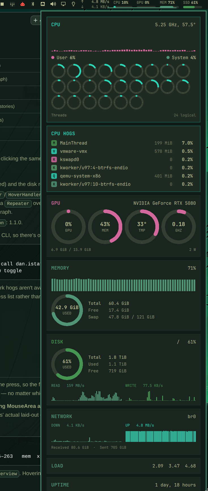

# iStats for Omarchy

An [iStat Menus](https://bjango.com/mac/istatmenus/)-shaped system monitor for the
Omarchy bar. Five readings live in the bar, each one its own click target, and the
dropdown opens focused on whichever reading you clicked.



## What it shows

**In the bar**

- Network — live download / upload rate
- CPU — utilisation with a meter
- GPU — utilisation with a meter
- MEM — used percentage with a meter
- SSD — root filesystem usage with a meter

**In the dropdown**

| Card | Contents |
|------|----------|
| CPU | frequency, package temperature, user/system history, a ring per logical thread, thread count |
| Processes | top processes by CPU, or by memory when memory is focused |
| GPU | utilisation, VRAM, temperature and clock dials, VRAM total and power draw |
| Memory | used percentage, history, total / free / swap |
| Disk | root filesystem usage, free space, read/write history |
| Network | download and upload graphs (independently scaled), interface and lifetime totals |
| Load | 1 / 5 / 15 minute load average |
| Uptime | time since boot |

## Click behaviour

Clicking a reading opens the dashboard with that domain first and highlighted, so
the number you pointed at is the one explained. Clicking the same reading again
closes the panel.

| Click | Opens with |
|-------|------------|
| Network | NETWORK first |
| CPU | CPU first, then CPU HOGS |
| GPU | GPU first |
| MEM | MEMORY first, then MEMORY HOGS |
| SSD | DISK first |
| anywhere else | neutral overview |

## Dashboard from a keybind

```bash
quickshell ipc -p /usr/share/omarchy/shell call io.github.dbachelder.istats toggle
```

Available methods: `open`, `close`, `toggle`, `overview`, `showCpu`, `showGpu`,
`showMem`, `showDisk`, `showNet`, `status`.

## Requirements

- Omarchy with the Quickshell shell (bar widget plugin API).
- `python3` — standard library only; no `psutil`, no `pynvml`, nothing to install.
- Linux `/proc` and `/sys`.
- Optional: an NVIDIA GPU with `nvidia-smi` on `PATH` for the GPU card and the GPU
  bar reading. Everything else works without it.

## Install

```bash
omarchy plugin add https://github.com/dbachelder/omarchy-istats.git --enable
```

`--enable` places the widget in its default section (right). To move it:

```bash
omarchy bar put io.github.dbachelder.istats --section right
```

## Remove

```bash
omarchy plugin remove io.github.dbachelder.istats
```

Removing the plugin stops the collector process with the widget; no service, timer
or file is left behind.

## Configuration

Settings are inline on the widget's `shell.json` entry. Set them with
`omarchy bar set`:

```bash
omarchy bar set io.github.dbachelder.istats showGpu false
omarchy bar set io.github.dbachelder.istats processCount 10
```

| Key | Default | Meaning |
|-----|---------|---------|
| `intervalSec` | `1` | Collector sample interval, in seconds (1–10) |
| `colorful` | `true` | Use the theme's accent palette; `false` uses the theme accent only |
| `showNet` | `true` | Show the network reading in the bar |
| `showCpu` | `true` | Show the CPU reading in the bar |
| `showGpu` | `true` | Show the GPU reading in the bar |
| `showMem` | `true` | Show the memory reading in the bar |
| `showSsd` | `true` | Show the disk reading in the bar |
| `processCount` | `6` | Rows in the process table (3–12) |

Colours follow the active Omarchy theme; the widget re-reads the theme palette when
you switch themes, so there is nothing to configure for it to look native.

## How it works

The widget starts one long-lived helper process:

```bash
python3 collector/istats_collector.py --interval 1
```

It prints a single compact JSON frame per tick on stdout, which the QML reads with
a `SplitParser`. There is no daemon, no systemd unit, no socket and no database;
the helper's lifetime is the widget's lifetime. History for the graphs is kept in
the shell process as a 60-sample ring buffer.

The collector only reads:

- `/proc/stat`, `/proc/meminfo`, `/proc/loadavg`, `/proc/uptime`, `/proc/net/dev`,
  `/proc/net/route`, `/proc/diskstats`, `/proc/self/mountinfo`, `/proc/<pid>/stat`
- `/sys/class/hwmon/*`, `/sys/devices/system/cpu/*/cpufreq/*`
- `nvidia-smi --query-gpu=...` when an NVIDIA GPU is present

## Security and permissions

- Runs entirely as your user. It never elevates privileges, never invokes an
  authentication agent or privileged helper, and never writes to system paths.
- No network access: the plugin makes no requests and downloads nothing.
- It does not modify your `shell.json`; you control every setting.
- The only child processes are the bundled Python collector and, on NVIDIA
  systems, `nvidia-smi`.

## Known limitations

- Per-process disk, GPU and network usage is not available without extra
  privileges, so DISK, GPU and NETWORK focus show the domain card plus the
  CPU-sorted process list rather than a domain-specific hog list. CPU and memory
  hog lists are exact.
- The memory hog list includes kernel threads, which can outrank user processes.
- GPU readings require an NVIDIA card with `nvidia-smi`. Imported AMD/Intel
  telemetry is not implemented yet.

## License

MIT — see [LICENSE](LICENSE).
